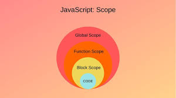
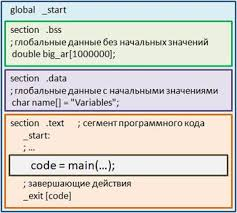
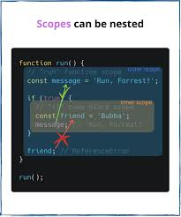
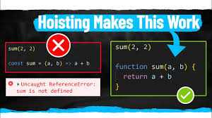
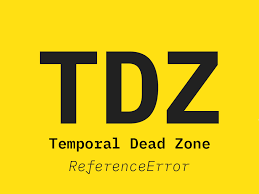

# Что такое Scope в JS

Область видимости (или scope) в JS – это как "зона доступа" 🚧 для переменных и функций. Если переменная объявлена глобально 🌍, её видно везде. Локально 🏠 – только внутри функции.

## Какие есть области видимости в JS?

* Область видимости глобаьный
* Блочная область видимости 
* Область видимости функции 
* Область видимости модуля 

 ## Глобальная и локальная область видимости 

Это два основных типа области видимости в JavaScript. Глобальные переменные объявляются вне всех функций и доступны отовсюду в коде. Это значит, что они могут быть использованы и изменены в любом месте программы. С другой стороны, локальные переменные объявляются внутри функций и доступны только в пределах этих функций. Это помогает избегать конфликтов имен и делает код более безопасным и предсказуемым.

## Блочная область видимости
 
В JavaScript вводится с помощью ключевых слов let и const. Эти переменные доступны только внутри блока (например, внутри цикла или условного оператора), в котором они были объявлены. Это предотвращает множество ошибок и делает код более читаемым и безопасным.

## Функциональная область видимости 
Функциональная область видимости — это область видимости в пределах тела функции. Можно сказать, что она ограничена { и } функции.

Функциональная область видимости — очень мощный инструмент для разделения кода. Во-первых, используя её, мы можем не опасаться за «пересечение имён» переменных.

* Но функции создают собственные области видимости, которые не пересекаются, поэтому в этом случае ошибки не будет.

* Так как области видимости у функций не пересекаются и не связаны, первая функция не может обратиться к «внутренностям» соседней или вложенной функции, внутренности соседней функции скрыты в её области видимости и недоступны вне её.

* Функциям доступны лишь переменные в её собственной области видимости (всё, что внутри её тела) и в родительских областях.

## Изоляция модулей с помощью IIFE 
Immediately Invoked Function Expression, IIFE — это функция, которая выполняется сразу же после того, как была определена.

Дело в том, что существующий механизм автоподстановки точек с запятой (ASI) срабатывает лишь в определённых случаях, в то время как строка, начинающаяся с (, не входит в перечень этих случаев. Поэтому опытные разработчики зачастую добавляют ; в тех случаях, когда их код может быть скопирован и добавлен в существующий.

# Hoisting 

Это уникальная особенность JavaScript, которая позволяет вам обращаться к переменным и функциям до того, как они были объявлены в коде.

Это когда JavaScript "поднимает" объявления переменных и функций наверх кода 🚀. Это значит, что вы можете использовать их до того, как они были объявлены. С var работает всегда, но с let и const – нет, там будет ошибка.

Hoisting решает проблему доступности переменных и функций, делая их доступными до их объявления в коде. Это упрощает написание программ, позволяя вызывать функции и обращаться к переменным в более гибком порядке. 🔄

Знание о hoisting важно, потому что помогает избежать ошибок, связанных с порядком объявления. Понимая, как JavaScript обрабатывает переменные и функции, вы можете писать более чистый и предсказуемый код. 🛠️

## Как hoisting работает с переменными?

В JavaScript есть три способа объявления переменных: var, let и const. И хотя все они используются для хранения данных, механизм hoisting влияет на них по-разному.

* var: Переменные, объявленные с помощью var, "поднимаются" в начало их области видимости. Это означает, что они инициализируются значением undefined до того, как выполнение кода достигнет их объявления. Это позволяет вам использовать переменные, объявленные через var, до их объявления в коде.

* let и const: В отличие от var, переменные, объявленные через let и const, также поднимаются, но остаются в так называемой "временной мертвой зоне" до момента их объявления. Это означает, что обращение к ним до объявления приведет к ошибке ReferenceError.

# TDZ в JavaScript

)

Временная мертвая зона (TDZ) — это область блока, в которой переменная недоступна до того момента, пока компьютер полностью не инициализирует ее значением . Блок — это пара фигурных скобок ( {...} ), используемых для группировки нескольких операторов. Инициализация происходит, когда вы присваиваете переменной начальное значение.

